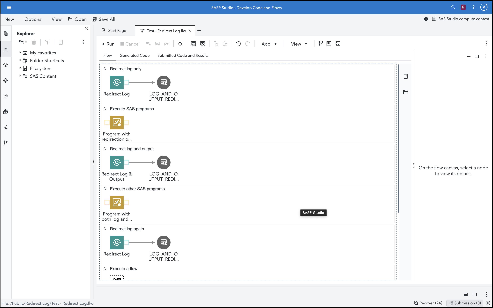

# Redirect Log

This custom step redirects log & procedural output of downstream SAS programs to specified external files, also reassigning them to the default location when needed.  

This will prove useful for scenarios requiring automated generation of log or output files.  For example, this step can be used to fulfill governance, regulatory and compliance objectives in industries such as banking and life sciences.


## A general idea

Click on the picture below to watch a quick demo: 

[](https://www.youtube.com/watch?v=5WsgHbq2C7w)

----
## Table of Contents
1. [Requirements](#requirements)
2. [Parameters](#parameters)
   1. [Input Parameters](#input-parameters)
   2. [Output Specifications](#output-specifications)
3. [Some common gotchas](#some-common-gotchas)
4. [Run-time Control](#run-time-control)
5. [Documentation](#documentation)
6. [SAS Program](#sas-program)
7. [Installation and Usage](#installation--usage)
8. [Created/Contact](#createdcontact)
9. [Change Log](#change-log)
----

## Requirements

- A SAS Viya 4 environment version 2024.04 or later.

----
## Parameters
----
### Input Parameters

1. **Redirection operation** (drop-down list, required): choose whether to redirect only the log, only the output, both log and output, or to reassign to default location.

2. **Log file location** (file selector, enabled if log redirection is selected): provide a path to a log file on the file system.  The path should be writeable.

3. **Output file location** (file selector, enabled if output redirection is selected): provide a path on the file system.  The path should be writeable.

----
### Output Specifications

- **Reference dataset** (output port, required):  connect a SAS dataset or CAS table to the output port of this custom step, to hold references to the redirected files. A timestamp is also added to indicate when this redirection occurred.

Every run of this step appends information to the reference dataset.  The dataset is created if it does not exist the first time.

----
### Some common gotchas

When used with improper understanding or familiarity, proc printto (the driving functionality in this custom step) might lead to confusion or errors. Please be aware of the following:

1. Log / output redirection are not perfect substitutes for ODS HTML / Excel etc.  The purpose behind redirection is for creating separate, specified log or listing files for persistence or communication.  ODS HTML (or ODS EXCEL and other equivalents) perform a similar function but offer more functionality such as  formatting  etc.

2. Output redirection does not automatically extend to plots, i.e. charts.  You'll find  upon examination that the log may provide an entry stating where the plot has been saved.  Use the ODS listing command to redirect graphics.  See https://communities.sas.com/t5/Graphics-Programming/Specify-SGPlot-png-output-location/td-p/622251 for a discussion.

3. When used within a SAS Studio Flow, log redirection will affect the status of nodes in a flow.  You will find that even when nodes are run successfully, a redirected log may cause the green tick mark to not appear.  Please be aware of the same.

4. This is NOT meant to be a log / output suppression mechanism for SAS Studio Flows.  This step neither guarantees nor intends to change the behaviour of product features and configuration in SAS Studio Flows or Steps.  

----
## Run-time Control

Note: Run-time control is optional.  You may choose whether to execute the main code of this step or not, based on upstream conditions set by earlier SAS programs.  This includes nodes run prior to this custom step earlier in a SAS Studio Flow, or a previous program in the same session.

Refer this blog (https://communities.sas.com/t5/SAS-Communities-Library/Switch-on-switch-off-run-time-control-of-SAS-Studio-Custom-Steps/ta-p/885526) for more details on the concept.

The following macro variable,
```sas
_rl_run_trigger
```

will initialize with a value of 1 by default, indicating an "enabled" status and allowing the custom step to run.

If you wish to control execution of this custom step, include code in an upstream SAS program to set this variable to 0.  This "disables" execution of the custom step.

To "disable" this step, run the following code upstream:

```sas
%global _rl_run_trigger;
%let _rl_run_trigger =0;
```

To "enable" this step again, run the following (it's assumed that this has already been set as a global variable):

```sas
%let _rl_run_trigger =1;
```


IMPORTANT: Be aware that disabling this step means that none of its main execution code will run, and any  downstream code which was dependent on this code may fail.  Change this setting only if it aligns with the objective of your SAS Studio program.

----
## Documentation

1.  [Documentation](https://go.documentation.sas.com/doc/en/pgmsascdc/default/proc/p1hwvc03z4tqlkn1owzhzo8e7ulu.htm) for the Proc Printto statement which redirects log and procedure output. 

2. This custom step makes use of a GOTO statement, a practice that purists consider  'bad' programming.  At the same time, GOTO can be tolerated in certain situations, as discussed in this [blog](https://smartbear.com/blog/goto-still-has-a-place-in-modern-programming-no-re/) (and hopefully valid in this context).   Note that there are many disussions on GOTO online, and this blog is presented as just one example.

3.  For a discussion on alternatives for graphs and charts, see [this](https://communities.sas.com/t5/Graphics-Programming/Specify-SGPlot-png-output-location/td-p/622251).


----
## SAS Program

Refer [here](./extras/Redirect%20Log.sas) for the SAS program used by the step.  You'd find this useful for situations where you wish to execute this step through non-SAS Studio Custom Step interfaces such as the [SAS Extension for Visual Studio Code](https://github.com/sassoftware/vscode-sas-extension), with minor modifications. 

----
## Installation & Usage

- Refer to the [steps listed here](https://github.com/sassoftware/sas-studio-custom-steps#getting-started---making-a-custom-step-from-this-repository-available-in-sas-studio).

----
## Created/contact: 

1. Lou Galway (lou.galway@sas.com)
2. Sundaresh Sankaran (sundaresh.sankaran@sas.com)

----
## Change Log

* Version 1.0 (25MAY2024) 
    * Initial version